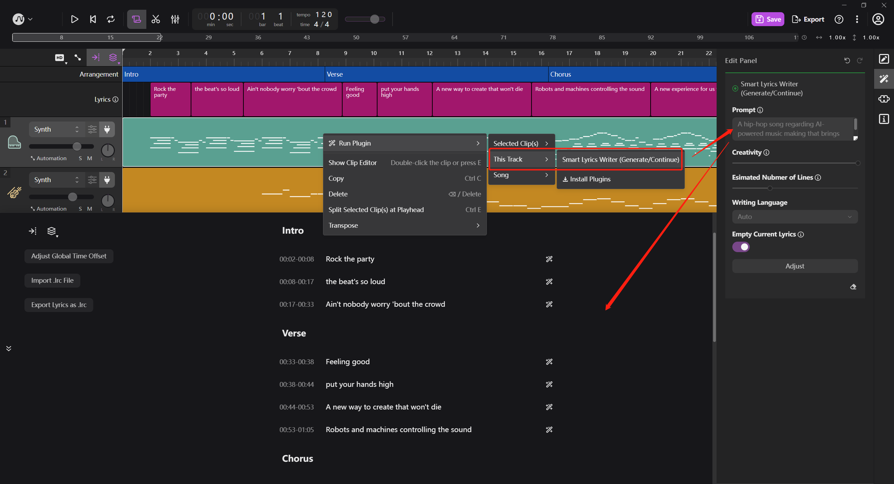
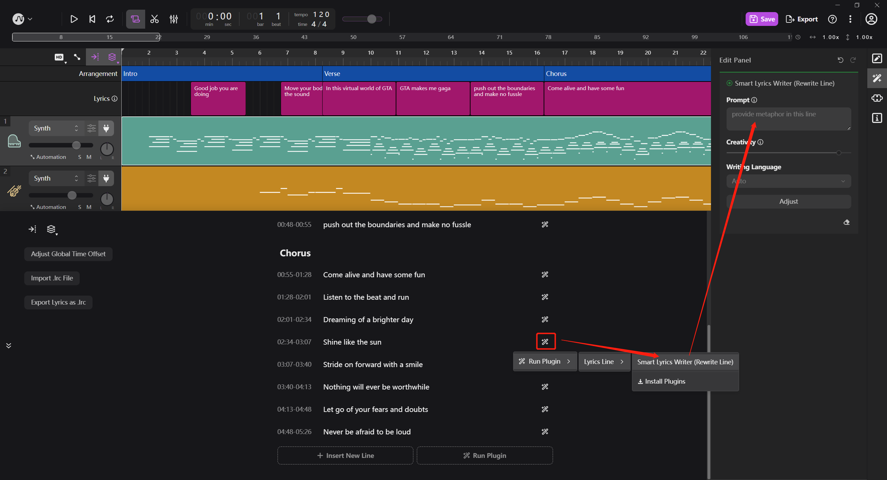
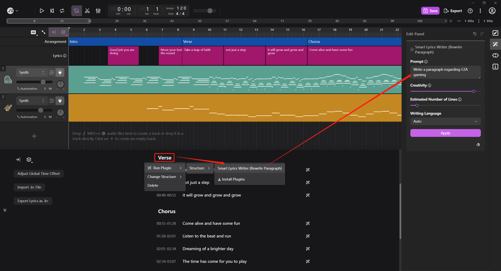

## Introduction

```GPT-Lyrics``` is an open-source lyric generator plugin supported by the AI DAW [TuneFlow](https://tuneflow.com). The text generation and completion is powered by OpenAI APIs.

```GPT-Lyrics``` prompts lyric writing from scratch, or lyric line and paragraph (such as intro, chorus, outro) rewrite/completion.


## Pre-requisite

Here are guidelines for testing or developing ```GPT-Lyrics``` in [TuneFlow](https://tuneflow.com).

* Download the AI DAW app from [TuneFlow](https://tuneflow.com) and install **TuneFlow Desktop** 

* Clone this repo

``` bash
git clone https://github.com/tuneflow/<repo-name>
```

* cd to the repo folder, and install dependencies using:

```bash
pip install -r requirements.txt
```

* OpenAI token setup

Create an ```.env``` file under the root directory of this repo to restore your OpenAI API tokens.

```bash
OPENAI_API_KEY='<Your API KEY>'
OPENAI_API_ENGINE='text-davinci-003'    # or 'gpt-3.5-turbo'
OPENAI_API_MAX_TOKENS=1024              # Maximum number of tokens allowed in requests
```

* Run the plugin in the developer mode:

```bash
python debug.py
```

* Start TuneFlow Desktop and create or open a song

* Switch to TuneFlow Plugin Library panel and at the upper-right corner, click on the "Load a local plugin in debug mode" button.

## Usage

The lyric plugin supports

* Write lyrics from scratch
* Rewrite/complete single lyric lines
* Rewrite/complete paragraphs (such as intro, chorus, outro)

| Write from Scratch | Line Completion | Paragraph Completion |
|---------|---------|---------|
|   |  |  |

## Suffix

- [TuneFlow - AI DAW - Easy Music Making](https://tuneflow.com/)
- [TuneFlow Developer](https://help.tuneflow.com/en/developer/)